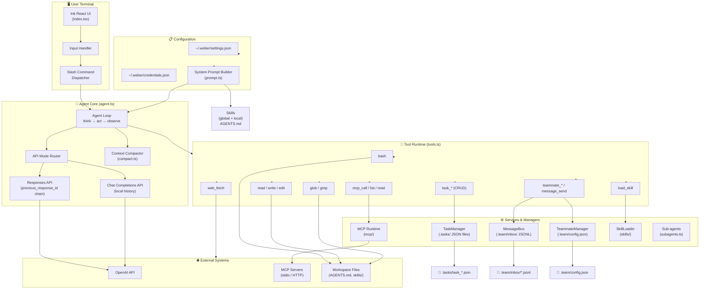

# weber Architecture

> A TypeScript-based CLI coding agent built with OpenAI SDK and Ink.

---

## High-Level Architecture Diagram



---

## Module Map

```
weber (CLI binary)
│
├── src/index.tsx           → Terminal UI (Ink/React), input loop, slash commands
├── src/agent.ts            → Core agent orchestration, API routing, tool dispatch
├── src/tools.ts            → 20+ tool schemas and handlers
├── src/config.ts           → Settings loading, provider/model resolution
├── src/prompt.ts           → System prompt composition (rules + skills + MCP + AGENTS.md)
├── src/compact.ts          → Context compaction strategies
│
├── src/task-manager.ts     → Persistent task DAG (JSON files)
├── src/message-bus.ts      → Append-only inbox messaging (JSONL)
├── src/teammate-manager.ts → Teammate lifecycle, wake/sleep
├── src/subagents.ts        → One-shot sub-agent spawner
│
├── src/mcp/
│   ├── client.ts           → MCP transport client
│   ├── manager.ts          → Connection lifecycle
│   ├── runtime.ts          → Tool/resource/prompt bridge
│   └── types.ts            → MCP protocol types
│
├── src/skills/
│   ├── index.ts            → SkillLoader
│   ├── loader.ts           → File discovery & parsing
│   ├── render.ts           → Skill content rendering
│   ├── frontmatter.ts      → YAML frontmatter parser
│   └── types.ts            → Skill type definitions
│
├── src/oauth/
│   └── openai.ts           → OpenAI OAuth flow
│
├── test/                   → Test suite (node:test)
├── docs/                   → Design notes & implementation docs
├── skills/                 → Example local skills (pdf, code-review)
└── scripts/postinstall.mjs → Default config bootstrap
```

---

## Data Flow (Single Turn)

```
1. User types a prompt
        │
2. index.tsx captures input & dispatches to agent.ts
        │
3. agent.ts builds system prompt via prompt.ts:
   • Built-in rules
   • Loaded skill descriptions (global + local)
   • MCP prompt instructions
   • Project AGENTS.md (if present)
        │
4. agent.ts sends [system + history + user message] to model
        │
5. Model responds with text and/or tool calls
        │
6. If tool calls:
   • agent.ts routes to handler in tools.ts
   • Handler executes (bash, file ops, MCP, etc.)
   • Result fed back to model
   • Repeat until model stops requesting tools
        │
7. Final response streamed back to UI
```

---

## Dual API Mode Architecture

| Feature | Responses API | Chat Completions |
|---------|--------------|------------------|
| State management | `previous_response_id` chain | Local message history array |
| Compaction | Periodic chain reset | Summary + truncation |
| Use case | OpenAI-native models | Compatible endpoints (DeepSeek, etc.) |
| Thinking tokens | Via reasoning deltas | N/A |

---

## Tool Hierarchy

```
🔒 ALL AGENTS (BASE_TOOLS)
├── bash           → Shell commands (timeout 120s, dangerous command blocked)
├── read_file      → Read workspace files
├── write_file     → Write workspace files
├── edit_file      → Exact-string replace in files
├── glob           → File search (ripgrep)
├── grep           → Content search (ripgrep)
├── web_fetch      → Fetch web pages (HTML → plain text)
├── task_*         → Task CRUD (create, update, list, get, complete, fail, block, assign)
├── list_mcp_resources / read_mcp_resource / mcp_call
└── load_skill     → Load skill by name

🔒 LEAD ONLY (TOOLS = BASE + ...)
├── task           → One-shot sub-agent dispatch
├── message_send   → Send async message to teammate
├── teammate_spawn / teammate_list / teammate_shutdown
└── (lead inbox auto-injected per turn)

🔒 TEAMMATE (TEAMMATE_TOOLS = BASE + message_send)
└── message_send   → Can send messages, but cannot spawn/delegate
```

---

## Persistence Model

| Component | Storage | Format |
|-----------|---------|--------|
| Settings | `~/.weber/settings.json` | JSON |
| Credentials | `~/.weber/credentials.json` | JSON |
| Tasks | `<workspace>/.tasks/task_*.json` | One JSON file per task |
| Team config | `<workspace>/.team/config.json` | JSON |
| Inboxes | `<workspace>/.team/inbox/*.jsonl` | Append-only JSONL |
| Skills (global) | `~/.weber/skills/`, `~/.claude/skills/` | SKILL.md + frontmatter |
| Skills (local) | `<workspace>/skills/` | SKILL.md + frontmatter |

---

## Key Design Principles

1. **Workspace-scoped** — All tools operate within `process.cwd()`, file access is sandboxed
2. **File-backed persistence** — No databases; JSON and JSONL on disk for simplicity
3. **Explicit modules** — One responsibility per file, direct composition over deep abstractions
4. **Defense in depth** — Dangerous command filtering (16 patterns), shell timeout, output truncation (50KB)
5. **Skill override chain** — `~/.weber/skills` → `~/.claude/skills` → `<workspace>/skills` (last wins)
6. **Teammate privilege reduction** — Teammates get fewer tools than lead to prevent recursive delegation
```

---


## Generated on

2026-01-22